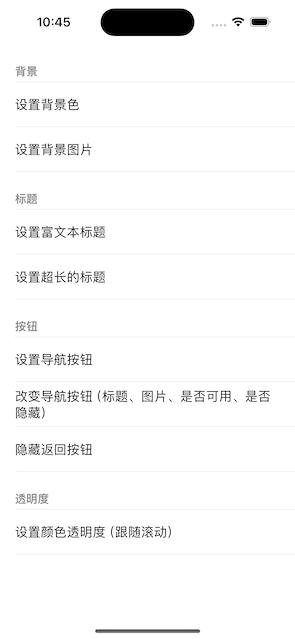
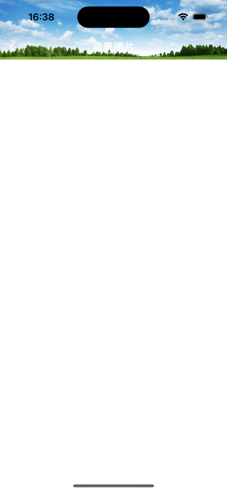

# AGNavigationBar

[](https://travis-ci.org/arthurguan/AGNavigationBar)
[](https://cocoapods.org/pods/AGNavigationBar)
[](https://cocoapods.org/pods/AGNavigationBar)
[](https://cocoapods.org/pods/AGNavigationBar)

## Screenshot
### Home


### BackgroundColor


### BackgroundImage


### AttributesTitle


### BarAction


### LongTitle


## Example

To run the example project, clone the repo, and run `pod install` from the Example directory first.

## Requirements

## Installation

AGNavigationBar is available through [CocoaPods](https://cocoapods.org). To install
it, simply add the following line to your Podfile:

```ruby
pod 'AGNavigationBar'
```

## Usage

```swift
let nav = AGNavigationBar(frame: CGRect(x: 0, y: 0, width: UIScreen.main.bounds.width, height: 88))
view.addSubview(nav)
```

More usage reference the example project

## Author

arthurguan, cgrect@126.com

## License

AGNavigationBar is available under the MIT license. See the LICENSE file for more info.
