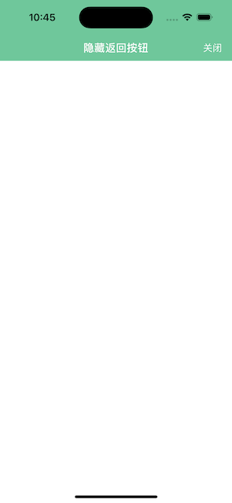

# AGNavigationBar

[](https://cocoapods.org/pods/AGNavigationBar)
[](LICENSE)
[](https://www.apple.com/nl/ios/)
[](https://www.apple.com/)


## Screenshot

### Demo


### BackgroundColor

```swift
navBar.barTintColor = .green
```


### BackgroundImage

```swift
AGNavigationBar.Config.backgroundImage = UIImage(named: "bg")
```


### AttributesTitle

```swift
navBar.titleTextAttributes = [
    .foregroundColor: UIColor.blue,
    .font: UIFont.systemFont(ofSize: 26, weight: .medium)
]
```


### LongTitle

No additional setup required


### BarAction

```swift
navBar.addAction(AGNavigationBarAction(title: "保存", position: .right))
navBar.addAction(AGNavigationBarAction(title: "朋友圈", position: .right, handler: { _ in
    print("朋友圈")
}))
navBar.addAction(AGNavigationBarAction(title: "关闭", position: .left, handler: { _ in
}))

navBar.actionTintColor = .yellow
```


### ChangeAction

```swift
navBar.addAction(AGNavigationBarAction(title: "保存", position: .right, handler: { action in
    action.title = "😁"
}))
navBar.addAction(AGNavigationBarAction(title: "朋友圈", position: .right, handler: { action in
    print("朋友圈")
    action.isHidden = true
}))
navBar.addAction(AGNavigationBarAction(title: "关闭", position: .left, handler: { action in
    action.isEnabled = false
}))
```


### HideBackAction

```
navBar.isBackHidden = true
```



### ChangeAlpha


## Example

To run the example project, clone the repo, and run `pod install` from the Example directory first.

## Requirements

- iOS 10.0
- Swift 5.0

## Installation

### Swift Package Manager

Add the following as a dependency to your `Package.swift`:

```swift
.package(url: "https://github.com/guanzhendong/AGNavigationBar", .upToNextMajor(from: "0.1.3"))
```

### CocoaPods

AGNavigationBar is available through [CocoaPods](https://cocoapods.org). To install it, simply add the following line to your Podfile:

```ruby
pod 'AGNavigationBar'
```

### Manual

Drop the swift files  [AGNavigationBar.swift](AGNavigationBar/Classes/AGNavigationBar.swift)  into your project.

## Usage

```swift
let nav = AGNavigationBar(frame: CGRect(x: 0, y: 0, width: UIScreen.main.bounds.width, height: 88))
view.addSubview(nav)
```

More usage reference the example project

## Author

arthurguan, cgrect@126.com

## License

AGNavigationBar is available under the MIT license. See the LICENSE file for more info.
